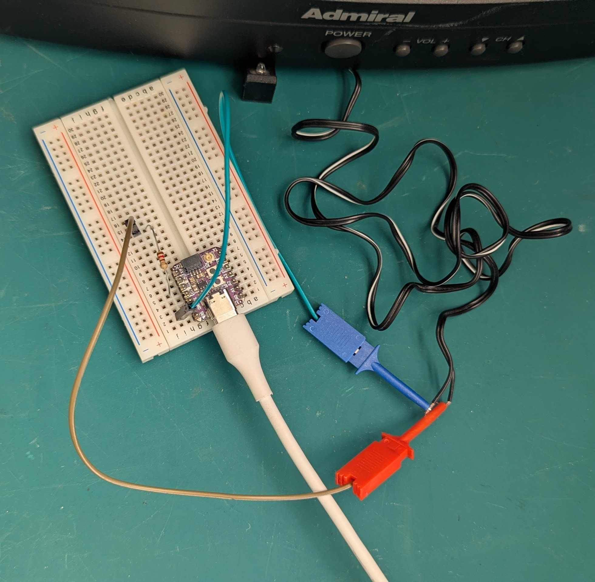

# IR TV Remote

Basic example using a microcontroller as an IR blaster.
Mine are from [Adafruit](https://adafruit.com/).

# Getting started

1. Install the [Arduino IDE](https://www.arduino.cc/en/software/), and the
   specific library for your microcontroller.

2. Connect an IR LED to one of the output pins, with an appropriate in-series
   resistor wire to GND. Using 3.3V output voltage, 1.2V drop over the IR LED,
   and 20mA current: V=I*R => R=V/I = (3.3-1.2)/(20/1000) = 105Ω ~= 100Ω.

3. Update the project for your TV:
   - Define `IR_SEND_PIN` to be the output pin you're using.
   - Define `IR_ADDRESS` for the TV you are using.
   - Define `IR_REPEATS` if needed for your TV.
   - Define `IR_REPEATS` if needed for your TV.
   - Define `IR_NUMBER_OF_BITS` as appropriate for your TV.
   - Define `IR_MIN_DELAY_MS` as appropriate for your TV.

5. Build and flash to the device.

6. Open the serial monitor and type one or more two-digit hex codes to send.
   For example, type `20` to send hex code `0x20` (menu, see `admiral.h`),
   or `121212` to send `0x12` (channel down) three times.